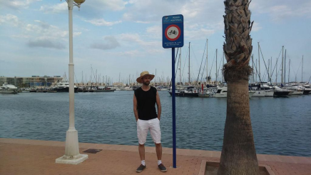

# About Me

## Interests

I have a deep passion for History, Geo-Politics, and Astro-Physics. I enjoy exploring the intricate details of these subjects and exchanging my knowledge with others.

I regularly fix computer problems (both software and hardware) for friends and family, finding great satisfaction in troubleshooting and resolving technical issues.

Additionally, one of my most fulfilling activities is teaching complex topics to individuals who initially find them daunting and witnessing their moments of understanding and empowerment. As a result, I often took on tutoring jobs for subjects such as Mathematics and Physics. In the end, it proved to be a win-win situation.

Of course I am also interested in a lot of "nerdstuff" and know a thing or two about _Warhammer 40k_ lore or _Magic the Gathering_'s seemingly infinite number of different cards.

Playing Games on PC and sometimes on gaming consoles stopped using my primary hobby a long time ago, but every now and then the old squad reassembles and we have fun like if we were children once again.

## Abilites

- I am an enthusiastic and fast learner, particularly when it comes to subjects that capture my interest, regardless of their complexity.
- While I may not always initiate conversations, I genuinely appreciate differing opinions and approaches. I find great value in engaging with people, particularly those who are experts in areas I'm eager to learn more about.
